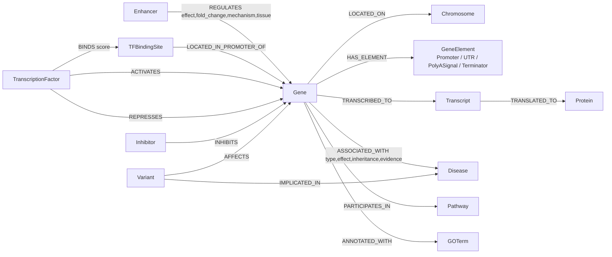

# Gene Regulation & Disease Ontology — Neo4j Schema

This document is the authoritative specification of the property-graph ontology:
every **node label**, every **relationship (edge) type**, and their properties.
It is a proof-of-concept graph modelling **gene regulatory elements**,
**gene→disease associations**, and the supporting molecular biology context.

The graph follows the biological "central dogma" plus a **cis-regulatory layer**
(promoters, enhancers, silencers, TF binding sites) and a **clinical layer**
(diseases, variants, drugs).

---

## 1. Node labels

| Label | Key | Purpose | Key properties |
|-------|-----|---------|----------------|
| `Gene` | `symbol` | A human gene (HGNC symbol). Primary entity. | `name`, `chromosome`, `cytoband`, `biotype`, `strand`, `tss`, `organism`, `taxon_id` |
| `GeneElement` | `id` | Umbrella label for a cis element belonging to one gene. The concrete kind is in `element_class`/`label`. | `label`, `element_class`, `chromosome`, `start`, `end`, `strand` |
| `Enhancer` | `id` | Distal cis-regulatory element that boosts/represses transcription, possibly far from the TSS. | `chromosome`, `start`, `end`, `tissue_specificity`, `activity_score` |
| `TFBindingSite` | `id` | Short motif within a promoter where a TF docks. | `chromosome`, `start`, `end`, `tf_symbol` |
| `TranscriptionFactor` | `symbol` | A protein that binds DNA and regulates transcription. | `name`, `family` |
| `Inhibitor` | `id` | A drug / small molecule / biologic that inhibits a gene product. | `name`, `modality` |
| `Transcript` | `id` | An mRNA isoform produced from a gene. | `biotype`, `exon_count` |
| `Protein` | `id` | The polypeptide translated from a transcript. | `uniprot_name`, `full_name` |
| `Disease` | `id` | A disease/phenotype (MONDO id). | `name`, `ontology` |
| `Variant` | `id` | A sequence variant (rsID) affecting a gene. | `consequence`, `clinical_significance`, `hgvs_c` |
| `Pathway` | `id` | A biological pathway (Reactome/KEGG). | `name`, `database` |
| `GOTerm` | `id` | A Gene Ontology annotation term. | `name`, `aspect` |
| `Chromosome` | `id` | A chromosome in a genome assembly. | `name`, `assembly` |

### 1.1 `element_class` values on `GeneElement`

`GeneElement` is a generic label so the loader stays APOC-free. The biological
subtype lives in `element_class` (and the finer name in `label`). Running the
optional APOC step (`04_optional_apoc.cypher`) additionally stamps these as real
secondary labels, so both of these work:

```cypher
MATCH (e:GeneElement {element_class:'Promoter'}) RETURN e     // always works
MATCH (e:Promoter) RETURN e                                    // after APOC step
```

| `element_class` | `label` examples | Biological role |
|-----------------|------------------|-----------------|
| `Promoter` | `CorePromoter`, `ProximalPromoter` | Site where RNA polymerase II is recruited; defines the TSS. |
| `PromoterMotif` | `TATABox`, `CpGIsland` | Sequence motifs inside/around the promoter. |
| `UTR` | `FivePrimeUTR`, `ThreePrimeUTR` | Untranslated regions; regulate translation & stability. |
| `PolyASignal` | `PolyASignal` | AAUAAA hexamer that directs 3′ cleavage & **poly-A tail** addition. |
| `Terminator` | `Terminator` | Transcription termination region. |

> **Extension slots** (documented, easy to add as more `element_class` values):
> `Silencer`, `Insulator`, `Operator`, `RiboswitchBindingSite`, `Exon`, `Intron`,
> `StartCodon`, `StopCodon`, `SpliceSite`, `LocusControlRegion`.

---

## 2. Relationship (edge) types

| Edge | From → To | Meaning | Properties |
|------|-----------|---------|------------|
| `LOCATED_ON` | `Gene` → `Chromosome` | Physical location. | — |
| `HAS_ELEMENT` | `Gene` → `GeneElement` | Gene owns this cis element. | `element_label` |
| `REGULATES` | `Enhancer` → `Gene` | **Enhancer acts on a gene** (see §3). | `effect`, `fold_change`, `distance_bp`, `mechanism`, `tissue`, `confidence`, `evidence` |
| `BINDS` | `TranscriptionFactor` → `TFBindingSite` | TF docks on a motif. | `score` |
| `LOCATED_IN_PROMOTER_OF` | `TFBindingSite` → `Gene` | Structural link of a site to its gene. | — |
| `ACTIVATES` | `TranscriptionFactor` → `Gene` | TF up-regulates the gene. | `activity_multiplier`, `tissue`, `evidence` |
| `REPRESSES` | `TranscriptionFactor` → `Gene` | TF down-regulates the gene. | `activity_multiplier`, `tissue`, `evidence` |
| `INHIBITS` | `Inhibitor` → `Gene` | Drug inhibits the gene product. | `action`, `mechanism` |
| `TRANSCRIBED_TO` | `Gene` → `Transcript` | Transcription. | `tag` |
| `TRANSLATED_TO` | `Transcript` → `Protein` | Translation. | — |
| `ASSOCIATED_WITH` | `Gene` → `Disease` | **Gene–disease association** (see §4). | `association_type`, `molecular_effect`, `inheritance`, `evidence_level`, `source` |
| `PARTICIPATES_IN` | `Gene` → `Pathway` | Gene is part of a pathway. | — |
| `ANNOTATED_WITH` | `Gene` → `GOTerm` | GO annotation. | `evidence_code` |
| `AFFECTS` | `Variant` → `Gene` | Variant hits a gene. | `consequence` |
| `IMPLICATED_IN` | `Variant` → `Disease` | Variant linked to a disease. | `clinical_significance`, `source` |

### 2.1 Why the edge *type* itself carries meaning

For transcription factors the **effect direction is encoded in the edge type**
(`ACTIVATES` vs `REPRESSES`), not only in a property. This is deliberate: the
same TF can activate one gene and repress another, so the direction is a
per-`(TF, gene)` fact. The loader (`03_load_relationships.cypher`) reads the
`effect` column and creates the matching edge type. That is exactly what the
brief means by *"edges can be changed based on gene names"* — the relationship
between two node types is not fixed; it is chosen from the data per gene.

---

## 3. How an enhancer affects other nodes (the headline requirement)

An `Enhancer` primarily targets a **`Gene`** through the `REGULATES` edge, and
the effect is fully described by the edge's properties — which differ for every
enhancer→gene pair:

```
(:Enhancer {tissue_specificity, activity_score})
        │
        │  [:REGULATES {
        │       effect:      'activates' | 'represses',   // direction
        │       fold_change: 1.5 .. 25.0,                 // magnitude of the effect
        │       distance_bp: linear genomic distance to the TSS,
        │       mechanism:   'chromatin_looping' | 'enhancer_RNA' | 'cohesin_mediated',
        │       tissue:      cell/tissue context the effect is seen in,
        │       confidence:  0..1 evidence score,
        │       evidence:    assay, e.g. 'Hi-C+eQTL'
        │  }]
        ▼
     (:Gene)  ──[:TRANSCRIBED_TO]──▶ (:Transcript) ──[:TRANSLATED_TO]──▶ (:Protein)
```

So an enhancer influences, transitively:

1. **`Gene`** — directly, up or down, quantified by `fold_change`.
2. **`Transcript`** — more/less mRNA is produced (downstream of the gene).
3. **`Protein`** — ultimately more/less protein (downstream of the transcript).

Because the effect is **tissue-scoped**, the same enhancer can activate a gene
in `liver` and be silent in `brain`; this is captured by the `tissue` property
rather than by duplicating nodes.

**Contrast with promoters and TFs:**
- A `Promoter` is *owned by* a gene (`HAS_ELEMENT`) and defines where
  transcription starts — it is structural, not a distal actor.
- A `TranscriptionFactor` binds a `TFBindingSite` inside the promoter
  (`BINDS` → `LOCATED_IN_PROMOTER_OF`) and then `ACTIVATES`/`REPRESSES` the gene.
- An `Inhibitor` acts at the protein-function level (`INHIBITS`), i.e. after
  translation, which is why it is modelled separately from cis regulation.

---

## 4. Gene–disease associations

`(:Gene)-[:ASSOCIATED_WITH]->(:Disease)` is enriched so the same edge type can
express very different biological claims:

| Property | Example values | Meaning |
|----------|----------------|---------|
| `association_type` | `causal`, `driver`, `predisposition`, `susceptibility` | Nature of the link. |
| `molecular_effect` | `loss_of_function`, `gain_of_function`, `dominant_negative`, `neomorphic`, `risk_allele`, `fusion` | How the gene change drives disease. |
| `inheritance` | `autosomal_dominant`, `autosomal_recessive`, `x_linked_recessive`, `x_linked_dominant`, `somatic`, `risk_factor` | Mode of inheritance. |
| `evidence_level` | `definitive`, `strong`, `moderate` | Strength of the gene–disease claim. |
| `source` | `OMIM`, `ClinVar`, `COSMIC`, `GWAS`, `Reactome`, `KEGG` | Provenance. |

Variants add a finer clinical layer: `(:Variant)-[:AFFECTS]->(:Gene)` and
`(:Variant)-[:IMPLICATED_IN]->(:Disease)` with a `clinical_significance`
(`pathogenic`, `likely_pathogenic`, `uncertain_significance`).

---

## 5. Schema diagram



---

## 6. Design decisions & conventions

- **Keys**: every node has a stable natural key backed by a uniqueness
  constraint (`Gene.symbol`, `Disease.id`, …), so loaders are idempotent
  (`MERGE`).
- **Coordinates** (`start`, `end`, `tss`) are integers on the `GRCh38`
  assembly; enhancer distance to a gene is stored as `distance_bp` on the edge.
- **Effect direction as edge type** for TFs; **effect direction as property**
  (`effect`) for enhancers — both patterns are shown intentionally so the POC
  demonstrates the two idiomatic ways Neo4j models "it depends on the gene".
- **Tissue context** lives on the *edge*, not the node, so one enhancer/TF node
  can regulate different genes in different tissues.

---

## 7. Extension roadmap (TBD items)

Suggested additional node/edge types to grow the graph beyond the POC:

| New node | New edges | Adds |
|----------|-----------|------|
| `Silencer`, `Insulator`, `LocusControlRegion` | `Silencer-[:REPRESSES]->Gene`, `Insulator-[:BLOCKS]->Enhancer` | negative & boundary regulation |
| `miRNA` / `ncRNA` | `miRNA-[:SILENCES {seed_match}]->Transcript` | post-transcriptional regulation of the poly-A'd mRNA |
| `Exon`, `Intron`, `SpliceSite` | `Transcript-[:HAS_EXON {order}]->Exon` | alternative splicing |
| `Tissue` / `CellType` (promote to node) | `Enhancer-[:ACTIVE_IN]->Tissue` | tissue-resolved regulation as first-class nodes |
| `ProteinComplex` | `Protein-[:PART_OF]->ProteinComplex` | multi-subunit machines (e.g. BCR-ABL) |
| `Drug` + `ClinicalTrial` | `Drug-[:INDICATED_FOR]->Disease` | drug-repurposing analytics |
| `Phenotype` (HPO) | `Disease-[:HAS_PHENOTYPE]->Phenotype` | fine-grained clinical features |
| `Protein-[:INTERACTS_WITH]->Protein` | — | PPI network for network-medicine queries |
